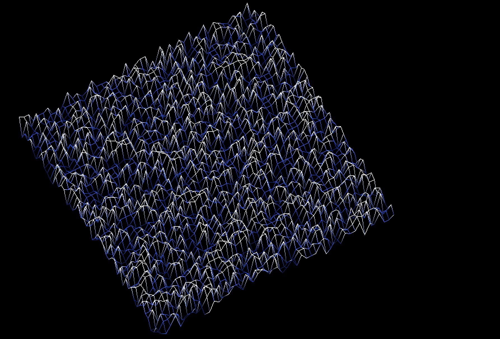
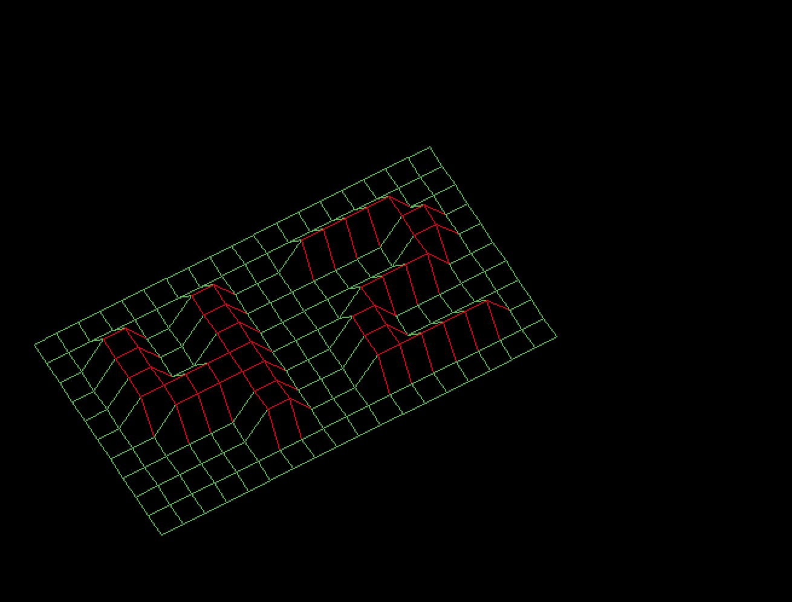
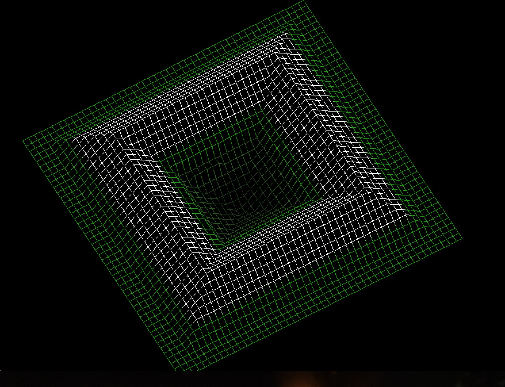
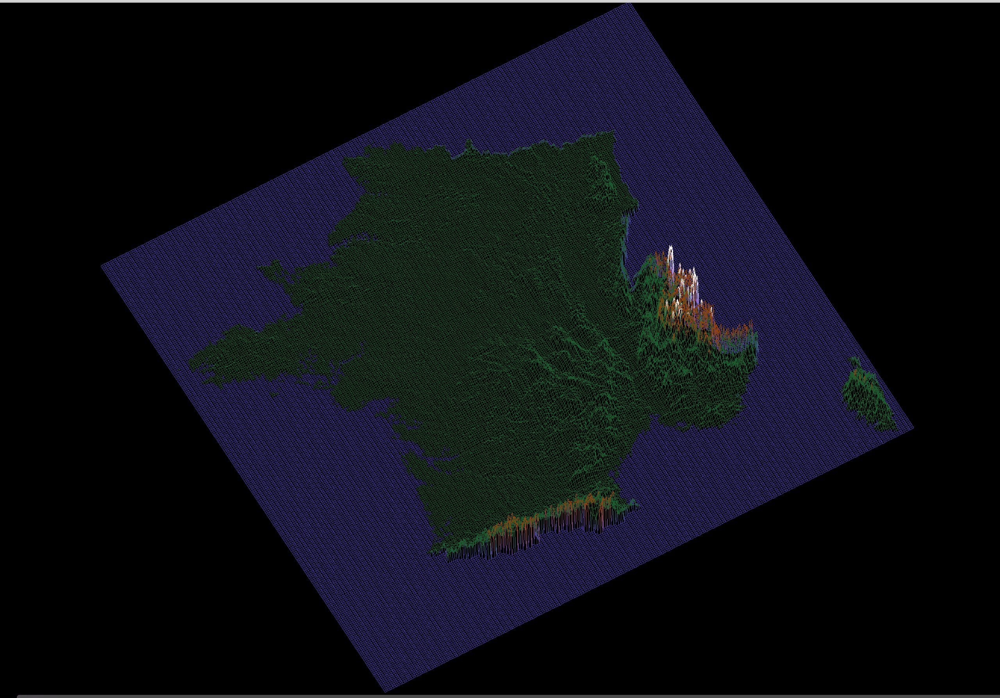

# Fdf

This is my first graphics project. It allows you to create 3D maps based on the given coordinates for each point on the map. The project was written using the MinilibX library. It is compiled with the Makefile. You can test it with the maps available in the ```test_maps``` folder. Have fun!

# Preview





